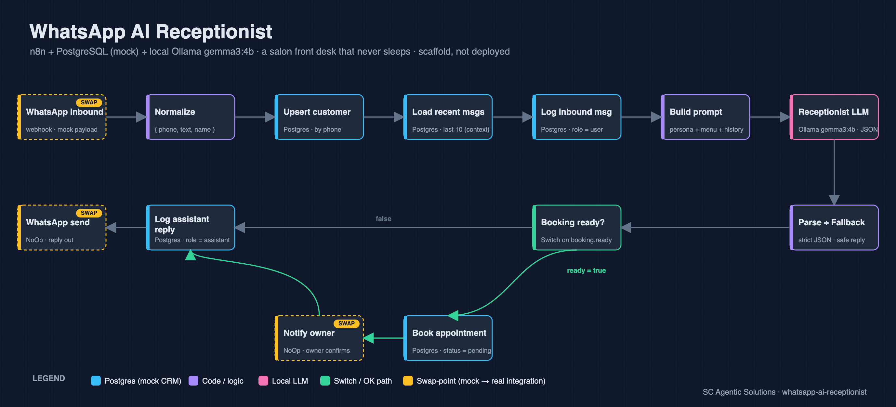

<!-- PUBLIC, publish-ready README for the `whatsapp-ai-receptionist` GitHub repo.
     At publish time this becomes the repo's README.md. Image paths point to assets/. -->

# WhatsApp AI Receptionist — a salon front desk that answers every message, day or night

**Built by [SC Agentic Solutions](#about-sc-agentic-solutions) — we turn business bottlenecks into working AI automations.**

Most bookings are lost in the gap between "the customer messaged" and "someone got back to them." Nights, weekends, mid-appointment — the phone buzzes and nobody's free. This agent picks up that slack: a customer messages the salon on WhatsApp, and a friendly receptionist replies **instantly** — answers questions, quotes services and prices from the real menu, captures a booking, collects the customer's details, and remembers the whole conversation. Bookings land as **pending** for the owner to confirm, so the human stays in control.

> **Status:** ✅ System architecture & design + reference implementation — a complete, documented n8n blueprint you can deploy on your own stack. It runs on your machine — [n8n](https://n8n.io) + PostgreSQL in Docker and a local [Ollama](https://ollama.com) model — with **no cloud, no API keys, and no data leaving your laptop**. WhatsApp, the owner notification, and the calendar sync are **labeled swap-points**: mock nodes marking exactly where a real Meta WhatsApp Cloud API / Slack / Calendly would plug in.



## What it does

A customer texts the salon's WhatsApp number. For every inbound message the agent:

1. **Normalizes** the message to `{ phone, text, name }`.
2. **Remembers the customer** — upserts them by phone number, and loads the last 10 messages so the conversation has context.
3. **Logs the inbound message** to conversation memory.
4. **Builds a grounded prompt** — a receptionist persona + the salon's real service menu (name, price, duration) + recent history + the new message.
5. **Reasons with a local LLM** (Ollama `gemma3:4b`, JSON-only output) to produce a reply plus a structured read of the customer's intent and any booking in progress.
6. **Parses safely** — strict JSON with a fallback: if the model ever returns something malformed, the customer still gets a sensible reply and one clarifying question. The flow never breaks.
7. **Captures a booking** — when the model has gathered **service + preferred time + name + email**, it writes a `pending` appointment and pings the owner to confirm.
8. **Logs the reply** and **sends it back** on WhatsApp.

The customer experience: *"What do you charge for a cut and color?"* → prices for exactly those two services. *"Can I book a balayage Friday afternoon?"* → the agent gathers whatever's missing (name, email), writes the pending request, notifies the owner, and replies *"Request received — we'll confirm shortly."*

## Why it's useful

- **No missed messages.** The front desk is staffed 24/7 without staffing it.
- **On-brand, on-menu.** The model quotes **only** from your `services` table — it can't invent a price or promise availability.
- **The owner stays in control.** Bookings are captured as `pending`; a human confirms before anything is final.
- **It remembers.** Every customer and message is stored, so the second conversation isn't a cold start.
- **Private by default.** The reasoning runs on a local model; customer data stays on your infrastructure.

## Architecture

`n8n` orchestrates a single linear workflow; `PostgreSQL` is the mock CRM + conversation memory; a local `Ollama` model does the reasoning.

```
WhatsApp inbound (mock webhook)
  → Normalize → Upsert customer → Load recent messages → Log inbound message
  → Build prompt → Receptionist LLM (Ollama, JSON) → Parse + Fallback
  → Booking ready?  ── true ─→ Book appointment (pending) → Notify owner (mock)
                    └─ false ─────────────────────────────┐
  → Log assistant reply → WhatsApp send (mock)  ←──────────┘
```

See [`DESIGN.md`](DESIGN.md) for the node-by-node breakdown, the data model, and the LLM contract.

### The swap-points (mock here → real integration in production)

| # | Swap-point | Mock in this build | Real integration |
|---|------------|-----------------------|------------------|
| 1 | **WhatsApp inbound** | Webhook node with a sample payload | Meta WhatsApp Cloud API inbound webhook |
| 2 | **WhatsApp send** | NoOp | Meta WhatsApp Cloud API send message |
| 3 | **Owner notify** | NoOp | WhatsApp / email / Slack to the owner |
| 4 | **Calendar sync on confirm** | (documented, not built) | Calendly / Acuity slot on owner confirmation |
| 5 | **LLM** | Local Ollama `gemma3:4b` | Any local or cloud model |

## Run it yourself

> Reference implementation — the steps below show how to stand it up on your own stack.

**Prerequisites:** Docker (n8n + PostgreSQL), and [Ollama](https://ollama.com) with `gemma3:4b` pulled (`ollama pull gemma3:4b`).

1. **Database.** Create a Postgres database and apply [`schema.sql`](schema.sql) — it's idempotent and seeds a realistic salon menu, two sample customers, and a short message thread.
2. **Ollama.** Make sure Ollama is serving on `11434`; the workflow calls `http://host.docker.internal:11434/api/generate` with `format: json`.
3. **n8n.** Import [`whatsapp-receptionist.workflow.json`](whatsapp-receptionist.workflow.json). Open the two Postgres nodes and pick your Postgres credential (they ship with the placeholder id `PLACEHOLDER_SELECT_IN_UI` — you select the real one in the UI).
4. **Try the flow.** Post a sample payload to the inbound webhook, e.g. `{ "from": "+15551234567", "text": "Do you do balayage?", "profile_name": "Maria" }`, and watch the reply come back through the mock send node.
5. **Go live (optional).** Replace the mock WhatsApp nodes with the Meta WhatsApp Cloud API, wire the owner-notify channel, and connect Calendly/Acuity at the confirmation step.

## Adapt it to another vertical

The workflow is business-agnostic — only two things carry the "salon" identity: the **`services` seed** and the **persona line** in the *Build prompt* node. Swap those two and the same receptionist works for a **barbershop, clinic, restaurant, cleaning service, or real-estate office**. Everything else — memory, booking capture, owner confirmation, the safe-fallback — stays exactly the same.

## Out of scope (v1 roadmap)

Reminders and follow-ups, real calendar/booking-tool sync, payments, multi-language, and multi-location routing are intentionally left out of this first build — they're the natural next steps.

## Credits & inspiration

Inspired by the *concept* of a clinic n8n agent ([Scheeza-Ahmad/Clinic-Agent-Using-n8n](https://github.com/Scheeza-Ahmad/Clinic-Agent-Using-n8n)). That project carries no license, so **none of its files were cloned or copied** — the workflow, schema, and docs here are our own, built from the design in [`DESIGN.md`](DESIGN.md). Credited as inspiration only.

## About SC Agentic Solutions

SC Agentic Solutions builds small, focused AI automations that remove real business bottlenecks — the kind a team feels every day. This receptionist is one of a series of demo agents that pair a clean [n8n](https://n8n.io) workflow with a **local** LLM, so the intelligence is private and the running cost is near zero.

**License:** [MIT](LICENSE) · © 2026 Santiago Ceron (SC Agentic Solutions)
